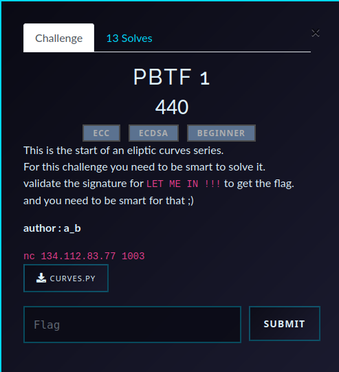

# PBTF 1 — ECDSA Challenge Writeup
This is a series of challenges about ECDSA .The first one PBTF 1 is supposed to be warmup to eliptic curves encryption .But the problem is that most of the series was solved by AI agents (or rather some die hard crypto players speedrunning hard challenges sub one hour ) .Thus you can see that 13 players managed to solved all the series but which was tghe same for the first challenge (challenges were hidden unless you finish the previous one) .


## Challenge Overview

- **CTF**: Pioneers25  
- **Challenge**: PBTF 1  
- **Category**: Cryptography  
- **Goal**: forge a valid ECDSA signature for `LET ME IN !!!`

<p align="center">
  
</p>

<details>
<summary>server.py</summary>

```python
from fastecdsa.curve import Curve

h=0x1 # isn't cofactor 1 vulnerable in the SafeCurve criteria?
curves=[
    Curve(
    name='PBTF-256-1',
    p=0xc59769064089032aefe1d9b94a43964a34e5ed517cf3cafdbc0fecc47499c71d,
    a=0x23c8127aa083ad1faf1c4048b2784b88c7b6ba2919d3182f2d7db0af6a40e526,
    b=0x6adce1bc23bca037f4b8da91a4b90dabd1615e19781e629c559a8a01fa26e03c,
    gx=0x03a1084f405fc4da90f135131a4800eff322beddda8f0b464f0e38bf0296de3f,
    gy=0x092f8b74bf78af05e207c8e97e30a38ff960822776c0a189e0128f5d1eac7028,
    q=0xc59769064089032aefe1d9b94a43964a366b4bc207b059e6bb393611decba301

),

    Curve(
    name='PBTF-256-2',
    p=0xdde6820f1b72450f12028b08ec08f5e562347594eb6977fc9bda410a5c144277,
    a=0x1895567ca66d68190822a55af4fa309973b0248b7bc50b2bfe22a0e029a71b5f,
    b=0x496f5c40e438f96ed7bb042f2ddfc93a638713f0693551d97cd3dbf4b8a191ce,
    gx=0x123ef25e3587dd03263ebe242e7e9fb18117677177c098e0894747d763d7f2e5,
    gy=0xaca50518613ce3c3965282cabdae9124f77ca4fe03264ad85692f80a56b1f57c,
    q=0xdde6820f1b72450f12028b08ec08f5e496cf9700198a0cd1a16aa884951db29d
),

    Curve(
    name='PBTF-256-3',
    p= 0x86c8eb8c323ef2868e6c871ce5fd1dbbbc2d5e60f69bc119dae00c0cbb98a3a3,
    a= 0x3ec86a0ce99fa52c7c3e6861de2cd6b0226275df8cd415f69642a0df02c82ef6,
    b=0x39956bc1bac07a7f40dc7e2d965738cf3f816c83ec2cda7dbd53f93683198f50,
    gx=0x3889867e5f0e5115d3fa2560365a000a8da388d77423339f38b6918b1fa6042a,
    gy=0x1d7d575b94cb87bf093c960ae4b95ff35a74077655d99e917334cd6265277a77,
    q=0x86c8eb8c323ef2868e6c871ce5fd1dbbbc2d5e60f69bc119dae00c0cbb98a3a3
),
    Curve(
    name='PBTF-256-4',
    p=0xbe9f01af5bdd5c819ea66455194b6cd95279bd21c4114c4a4cb584a994a25ce3,
    a=0x91dd4d17195921550622b5b19ffbebb166b11bdb1b203f95af14e1d2ff0cfe08,
    b=0x51f3a44632e2c99499cbc131cc15cb09dc1deaadade9eb857c77faf2cf789fef,
    gx=0x5059b2f77e8f9d6ad91e1590d08f0b7cc3d6fa5c182935ca112016acc9548c94,
    gy=0xb877a60ca722b3fbccf7f89b513e638d073a0749c004da97fa9e24a2605cc2d0,
    q=0xbe9f01af5bdd5c819ea66455194b6cd95279bd21c4114c4a4cb584a994a25ce3
),
    Curve(
    name='PBTF-256-5',
    p=0x89445f52a5e032acb3eb9acce5502976e7d61632181ecdaf47b61d357b841e07,
    a=0x5b87a9cc9693290ea27c604b569e89468ab3a76edff8c47d8afd5653775a2574,
    b=0x26956ff572c7f56293a76fe4746b4a8f8b474e7ddc4e8380905212ed0f215e65,
    gx=0x1829e68c94865b3013a040574233acd2ecf1abdd9cfdc3dbfda0fad131df56af,
    gy=0x5377dfa1e78352d4191e8526bb3354747612e8a837c9d3a3230d3640421b69ed,
    q=0x89445f52a5e032acb3eb9acce5502976e7d61632181ecdaf47b61d357b841e07
)
]
```

</details>

The service exposes curve info, public key, and a signing oracle for arbitrary messages (except the target).  
At first glance it looks like a normal ECDSA challenge, but one family of curves is catastrophically weak.

---

## Short Version (TL;DR)
Some challenge curves are **anomalous**: they satisfy $|E(\mathbb{F}_p)| = p$ (equivalently in this setup, `q == p`).  
For anomalous curves, the elliptic-curve discrete logarithm can be solved efficiently via **Smart’s attack**.

So the exploit is:

1. query curve + public key,
2. skip non-anomalous curves,
3. recover private key from public key using Smart attack,
4. sign `LET ME IN !!!`,
5. submit `(r, s)` and get the flag.

---

## Why ECDSA breaks here

ECDSA security relies on ECDLP hardness: given $Q=dG$, finding $d$ should be infeasible.

In this challenge, three curves are generated with `q == p`, making them anomalous.  
On anomalous curves, Smart attack maps the problem into a linear relation over a $p$-adic lift, turning the discrete log into a modular division.

So instead of generic $\tilde O(\sqrt q)$ complexity, private key recovery becomes practical.

---

## What the solver does

It implements Smart attack on anomalous curves (same attack used [Here](https://github.com/jvdsn/crypto-attacks/blob/master/attacks/ecc/smart_attack.py)).
The challenge description hint points directly to this attack.

Your `solver.sage` already implements the full pipeline:

1. Connects to service and asks for curve info.
2. Rejects `PBTF-256-1` and `PBTF-256-2`.
3. Builds the selected curve in Sage.
4. Runs `attack(G, pubkey)` (Smart attack) to recover private key.
5. Re-implements challenge signing logic:
   - hash is `sha256(message)[:8]` as integer,
   - nonce generation mirrors server behavior,
   - computes valid `(r, s)`.
6. Submits signature for `LET ME IN !!!` and prints flag.

---

## Running the solution

From this folder:

```bash
sage solver.sage
```

<details>
<summary>solver.sage</summary>

```
import logging
from sage.all import EllipticCurve
from sage.all import Qq
from sage.all import *
from fastecdsa.point import Point
from curves import curves
from pwn import *
from Crypto.Util.number import inverse ,bytes_to_long,long_to_bytes
import hashlib

# Convert a field element to a p-adic number.
def _gf_to_qq(n, qq, x):
    return ZZ(x) if n == 1 else qq(list(map(int, x.polynomial())))


# Lift a point to the p-adic numbers.
def _lift(E, p, Px, Py):
    for P in E.lift_x(Px, all=True):
        if (P.xy()[1] % p) == Py:
            return P


def attack(G, P):
    """
    Solves the discrete logarithm problem using Smart's attack.
    More information: Smart N. P., "The Discrete Logarithm Problem on Elliptic Curves of Trace One"
    More information: Hofman S. J., "The Discrete Logarithm Problem on Anomalous Elliptic Curves" (Section 6)
    :param G: the base point
    :param P: the point multiplication result
    :return: l such that l * G == P
    """
    E = G.curve()
    assert E.trace_of_frobenius() == 1, f"Curve should have trace of Frobenius = 1."

    F = E.base_ring()
    p = F.characteristic()
    q = F.order()
    n = F.degree()
    qq = Qq(q, names="g")

    # Section 6.1: case where n == 1
    logging.info(f"Computing l % {p}...")
    E = EllipticCurve(qq, [_gf_to_qq(n, qq, a) + q * ZZ.random_element(1, q) for a in E.a_invariants()])
    Gx, Gy = _gf_to_qq(n, qq, G.xy()[0]), _gf_to_qq(n, qq, G.xy()[1])
    Gx, Gy = (q * _lift(E, p, Gx, Gy)).xy()
    Px, Py = _gf_to_qq(n, qq, P.xy()[0]), _gf_to_qq(n, qq, P.xy()[1])
    Px, Py = (q * _lift(E, p, Px, Py)).xy()
    l = ZZ(((Px / Py) / (Gx / Gy)) % p)

    if n > 1:
        # Section 6.2: case where n > 1
        G0 = p ** (n - 1) * G
        G0x, G0y = _gf_to_qq(n, qq, G0.xy()[0]), _gf_to_qq(n, qq, G0.xy()[1])
        G0x, G0y = (q * _lift(E, p, G0x, G0y)).xy()
        for i in range(1, n):
            logging.info(f"Computing l % {p ** (i + 1)}...")
            Pi = p ** (n - i - 1) * (P - l * G)
            if Pi.is_zero():
                continue

            Pix, Piy = _gf_to_qq(n, qq, Pi.xy()[0]), _gf_to_qq(n, qq, Pi.xy()[1])
            Pix, Piy = (q * _lift(E, p, Pix, Piy)).xy()
            l += p ** i * ZZ(((Pix / Piy) / (G0x / G0y)) % p)

    return int(l)
def ECDSA_sign(message,curve,order,privkey):
        G = Point(curve.gx, curve.gy, curve=curve)
        k = gen_k(message)
        r = (k*G).x % order
        s = inverse(k, order) * (h(message) + r * privkey) % order
        return (r, s)
def h(message):
    return bytes_to_long(hashlib.sha256(message).digest()[:8])

def gen_k(name):
    return h(long_to_bytes(random.randrange(h(b'k'))))

if __name__ == "__main__":
    

    io=process(['python3','PBTF/PBTF1/server.py'])
    
    io.sendline(b'a')
    io.sendline(b'3')

    io.recvuntil(b'Name: ')
    curve_name = io.recvline().decode().strip()
    print(curve_name)
    if curve_name == "PBTF-256-1" or curve_name== "PBTF-256-2":
        print('invalid')
        io.close()
        exit()

    elif curve_name == "PBTF-256-3":
        curve = curves[2]

    elif curve_name == "PBTF-256-4":
        curve = curves[3]
    elif curve_name == "PBTF-256-5":
        curve = curves[4]


    io.recvuntil(b'public key:')
    kk=io.recvline().decode().strip()
    pkx, pky = map(int, kk.split(","))

    F = GF(curve.p)
    E = EllipticCurve(F, [curve.a, curve.b])
    G = E(curve.gx, curve.gy)
    order = curve.q
    pubkey = E(pkx, pky)
    print(attack(G, pubkey))
    
    a,b=ECDSA_sign(b'LET ME IN !!!', curve, order, attack(G, pubkey))
    io.sendline(b'1')
    io.recvuntil(b'r: ')
    io.sendline(str(a).encode())
    io.recvuntil(b's: ')
    io.sendline(str(b).encode())
    io.recvuntil(b'flag')
    print(io.recvline().decode())

    io.close()

```

</details>
This pops out the flag Pioneers25{g3771ng_5m4r73r_3v3ry_d4y}

---

## Mathematical intuition (compact)

For anomalous curves, after lifting points into a suitable $p$-adic setting, the formal group map gives:

$$
\phi(P)=d\,\phi(G) \pmod p
$$

Hence:

$$
d=\phi(P)\,\phi(G)^{-1} \pmod p
$$

That single relation is the core reason the secret key is recoverable.

---

## Takeaways

- ECDSA can be perfectly implemented and still fail if curve parameters are weak.
- Curve validation matters as much as signature logic.
- `q == p` (anomalous trace-1 behavior) is a major red flag.

---

## Reference

- [N. P. Smart, *The Discrete Logarithm Problem on Elliptic Curves of Trace One](https://cryptodeeptech.ru/doc/HPL-97-128.pdf)
