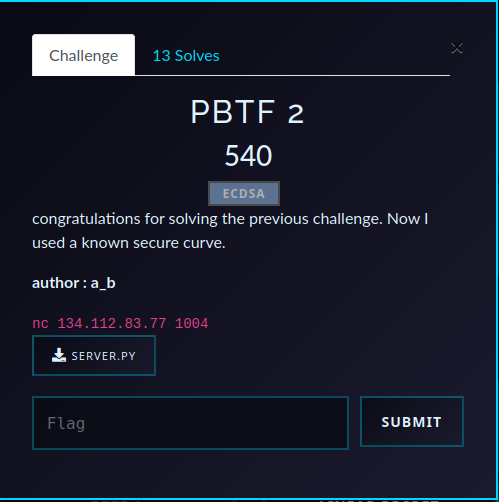

# PBTF 2 — ECDSA Challenge Writeup

## Challenge Overview

- **CTF**: Pioneers25  
- **Challenge**: PBTF 2  
- **Category**: Cryptography  
- **Goal**: forge a valid ECDSA signature for `LET ME IN !!!`

<p align="center">
  
</p>

<details>
<summary>server.py</summary>

```python
from Crypto.Util.number import inverse ,bytes_to_long,long_to_bytes
from fastecdsa.curve import P256 as EC
from fastecdsa.point import Point
import random, hashlib
from redacted import *
import numpy as np 


class ECDSA:
    def __init__(self):
        
        self.G = Point(EC.gx, EC.gy, curve=EC)
        self.order = EC.q
        self.privkey = random.randrange(1, self.order - 1)
        self.pubkey = (self.privkey * self.G)

    def info(self):
        print(info.format(curve=EC, pubkey=self.pubkey))

    def ECDSA_sign(self, message):
        
        k = k_gen(message.decode())
        r = (k*self.G).x % self.order
        s = inverse(k, self.order) * (h(message) + r * self.privkey) % self.order
        return (r, s)

    def ECDSA_verify(self, message, r, s):
        r %= self.order
        s %= self.order
        if s == 0 or r == 0:
            return False
        
        s_inv = inverse(s, self.order)
        u1 = (h(message)*s_inv) % self.order
        u2 = (r*s_inv) % self.order
        W = u1*self.G + u2*self.pubkey
        return W.x == r
    
def h(message):
    return bytes_to_long(hashlib.sha256(message).digest()[:8])

def k_gen(name):
    limit=np.array(list(map(ord, name))).prod()
    return h(long_to_bytes(random.randint(0,limit)))
    
MAX_ATTEMPTS=10

if __name__ == "__main__":

    
    ECDSA = ECDSA()
    print('Identify yourself')
    name = input("> ").strip().encode()
    test=all(32<b<128 for b in name)
    if not test:
        print("Name must be printable ASCII!")
        exit()
    print(menu)
    for _ in range (MAX_ATTEMPTS):
        try:
            print("Choose an option:")
            choice = input("> ").strip()
            if not choice.isdigit():
                print("Please enter a number.")
                continue
            if choice == '1':
                
                r=int(input("r: ").strip())
                s=int(input("s: ").strip())
                if ECDSA.ECDSA_verify(b'LET ME IN !!!', r, s):
                    print("Valid signature!")
                    print('Welcome ', name.decode())
                    print(f"Here is your flag: {FLAG}")
                else:
                    print("Invalid signature!")
            
            
            elif choice == '2':
                print('Provide the message to sign')
                message = input("> ").strip().encode()
                if message==b'LET ME IN !!!':
                    print("You are not allowed to sign this message!")
                    continue
                test=all(32<b<128 for b in message)
                if test:
                    r, s = ECDSA.ECDSA_sign(message)
                    print('Signature: ({},{})'.format(r, s))
                else:
                    print("Message must be printable ASCII!")

            elif choice == '3':
                ECDSA.info()
            
            elif choice == '4':
                print("Exiting...")
                break

            else:
                print("Invalid choice!")
            print()
        except KeyboardInterrupt:
            print("\nForcing exit :(")
            break
        except Exception as e:
            print("Error:", e)
            print("Please try again.")
            print()
```

</details>

This challenge uses P-256, so the curve itself is fine. The weakness is in nonce generation (`k_gen`), not in ECC parameters.

---

## Short Version (TL;DR)

The server signs with:

- `r = (kG).x mod n`
- `s = k^{-1}(h(m)+r*d) mod n`

but computes:

- `limit = np.array(list(map(ord, name))).prod()`
- `k = h(long_to_bytes(random.randint(0, limit)))`

By sending a message of `'@' * 384`, the NumPy product overflows to `0` (`np.int64` wraparound), so `random.randint(0, 0) == 0` always.

Therefore `k` becomes a known constant:

$$k = h(\texttt{long\_to\_bytes}(0))$$

With one oracle signature on that crafted message, recover private key:

$$
d = r^{-1}(ks - h(m)) \bmod n
$$

Then sign `LET ME IN !!!` and submit.

---

## Why ECDSA breaks here

ECDSA itself is not broken. The implementation violates the nonce requirement: `k` must be uniformly random and secret per signature.

Here, the nonce source is message-dependent and bounded by a NumPy product that can overflow. That turns a random nonce into a predictable nonce.

Once `k` is known for any signature, the private key is immediately recoverable.

---

## Vulnerability details

The critical line is:

```python
limit=np.array(list(map(ord, name))).prod()
```

NumPy uses fixed-width integers (`int64` here). For large products, multiplication wraps modulo $2^{64}$.

Choosing `name = '@' * 384` gives each character value `64 = 2^6`, so:

$$
64^{384} = 2^{2304}
$$

In `int64`, this wraps to `0`, so `limit == 0`.

Then:

```python
random.randint(0, limit)
```

becomes `random.randint(0, 0)`, i.e., always `0`. So nonce is fully known.

---

## What the solver does

Your `solver.py` implements the full exploit flow:

1. Start process and authenticate.
2. Ask server to sign crafted message `ff = '@' * 384`.
3. Locally compute the same deterministic `k`.
4. Parse returned `(r, s)`.
5. Recover private key using:
   - `d = inverse(r, n) * (k*s - h(m)) % n`
6. Re-sign target message `LET ME IN !!!` using recovered key.
7. Submit forged signature and print flag.

<details>
<summary>solver.py</summary>

```python
from pwn import *
import numpy as np
from Crypto.Util.number import long_to_bytes,bytes_to_long,inverse
import hashlib
import random
from fastecdsa.curve import P256 as EC
from fastecdsa.point import Point
import os, random, hashlib
io=process(['python3','PBTF/PBTF2/server.py'])


class ECDSA:
    def __init__(self,priv):
        self.G = Point(EC.gx, EC.gy, curve=EC)
        self.order = EC.q
        self.privkey = priv
        self.pubkey = (self.privkey * self.G)

    def ecdsa_sign(self, message,k):
        
        r = (k*self.G).x % self.order
        s = inverse(k, self.order) * (h(message) + r * self.privkey) % self.order
        return (r, s)
    def ecdsa_verify(self, message, r, s):
        r %= self.order
        s %= self.order
        if s == 0 or r == 0:
            return False
        
        s_inv = inverse(s, self.order)
        u1 = (h(message)*s_inv) % self.order
        u2 = (r*s_inv) % self.order
        W = u1*self.G + u2*self.pubkey
        return W.x == r
    


ff='@'*384

n=0xffffffff00000000ffffffffffffffffbce6faada7179e84f3b9cac2fc632551
def h(message):
    return bytes_to_long(hashlib.sha256(message).digest()[:8])

def k_gen(name):
    limit=np.array(list(map(ord, name))).prod()
    return h(long_to_bytes(random.randint(0,limit)))
k=k_gen(ff)

io.sendline(b'aa')
io.sendline(b'2')
io.sendline(ff.encode())
z1=h(ff.encode())

io.recvuntil(b'Signature: (')
r,s=io.recvuntil(b')').strip().decode()[:-1].split(',')
r,s=int(r),int(s)
print(r,s)

found_key = found_key = inverse(r, n) * (k * s -h(ff.encode())) % n
print(found_key)

ECDS=ECDSA(found_key)
r1,s1=ECDS.ecdsa_sign(b'LET ME IN !!!',k)

io.sendline(b'1')
io.sendline(str(r1).encode())
io.sendline(str(s1).encode())


io.recvuntil(b'g:')
print(io.recvline().decode().strip())
io.close()
```

</details>

---

## Running the solution

From this folder:

```bash
python3 solver.py
```
This pops out the flag Pioneers25{d0_n07_45k_7h3_4u7h0r_4b0u7_wh47_PBTF_m34n5}. 

---

## Mathematical intuition (compact)

Given one signature $(r,s)$ on message $m$ with known nonce $k$:

$$
s \equiv k^{-1}(h(m)+rd) \pmod n
$$

Multiply by $k$ and isolate $d$:

$$
d \equiv r^{-1}(ks-h(m)) \pmod n
$$

That is exactly what the solver computes.

---

## Takeaways

- Secure curves do not help if nonce generation is weak.
- Never build nonces from `random.randint` + message-dependent bounds.
- Avoid NumPy fixed-width arithmetic for cryptographic bounds.
- Use RFC 6979 deterministic nonces or CSPRNG-backed nonces directly modulo `n`.

---

## Reference

- SEC 1 / ECDSA standard behavior (nonce secrecy requirement)
- RFC 6979 deterministic ECDSA nonces
