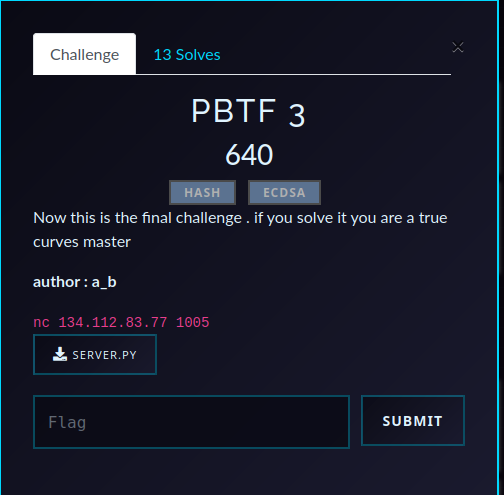

# PBTF 3 — ECDSA Challenge Writeup

## Challenge Overview

- **CTF**: Pioneers25  
- **Challenge**: PBTF 3  
- **Category**: Cryptography  
- **Goal**: forge a valid ECDSA signature for `LET ME IN !!!`

<p align="center">
  
</p>

The challenge uses P-256, so the curve itself is not the problem.  
The real bug is how nonces are generated and reused.

---

## Handout code (relevant parts)

<details>
<summary>server.py</summary>

```python
from Crypto.Util.number import inverse ,bytes_to_long,long_to_bytes
from fastecdsa.curve import P256 as EC
from fastecdsa.point import Point
import random, hashlib
from redacted import *

class ECDSA:
    def __init__(self):
        self.G = Point(EC.gx, EC.gy, curve=EC)
        self.order = EC.q
        self.privkey = random.randrange(1, self.order - 1)
        self.pubkey = (self.privkey * self.G)

    def ECDSA_sign(self, message):
        k = random.choice(k_list)
        r = (k*self.G).x % self.order
        s = inverse(k, self.order) * (h(message) + r * self.privkey) % self.order
        return (r, s)

    def ECDSA_verify(self, message, r, s):
        r %= self.order
        s %= self.order
        if s == 0 or r == 0:
            return False
        s_inv = inverse(s, self.order)
        u1 = (h(message)*s_inv) % self.order
        u2 = (r*s_inv) % self.order
        W = u1*self.G + u2*self.pubkey
        return W.x == r

def h(message):
    return bytes_to_long(hashlib.sha256(message).digest()[:8])

def k_gen(name):
    global k_list
    k_list=[h(long_to_bytes(random.randrange(h(name)))) for _ in range(10)]
```

</details>

---

## TL;DR

The server does this once per session:

```python
k_list=[h(long_to_bytes(random.randrange(h(name)))) for _ in range(10)]
```

And for every signature:

```python
k = random.choice(k_list)
```

So signatures use nonces from a tiny reused pool. With one observed signature `(r, s)` and a small candidate set for `k`, we test candidates, recover a private key candidate, and submit a forged signature.

**Key point:** for the crafted identity used in the solver, the first 8 bytes of `sha256(name)` contain **7 null bytes**, which heavily shrinks `random.randrange(h(name))`. In practice this makes the session nonce pool collapse to about **4 distinct `k` values**.

---


## Why this is vulnerable

ECDSA requires nonce `k` to be unpredictable and never reused.

Here:

1. `k_list` has only **10 elements**.
2. Those elements are reused across signature requests.
3. The range depends on attacker-controlled `name`.

This dramatically reduces nonce entropy. Once we get one signature for a known message, we can iterate candidate nonces and recover candidate private keys until one verifies.

---

## Why the chosen name helps

Your solver uses this crafted identity:

`jffry/21+GHs/1xRTX4090/CanYouHashFaster/AAAAAClvyNYha4f`

The goal is to make `h(name)` produce a bound that leads to many repeated outputs in:

`h(long_to_bytes(random.randrange(h(name))))`

For this exact payload, the first 8 bytes of the name hash have **7 zero bytes**, so the bound is extremely small. That creates heavy collisions and reduces the effective candidate nonce set to only **4 different `k` values**, which is why brute-testing candidate keys fits easily in the attempt limit.

---

## Exploit math

From ECDSA signing:

$$
s \equiv k^{-1}(h(m)+rd) \pmod n$$

Rearrange to recover private key from candidate nonce:

$$d \equiv r^{-1}(ks-h(m)) \pmod n$$

So for each candidate `k`, we compute candidate `d`, sign the target message, and test it.

---

## Solver flow

1. Connect to service.
2. Send crafted identity payload.
3. Request signature on `aa` and parse `(r, s)`.
4. Regenerate a small candidate set of `k` values locally.
5. For each candidate `k`:
   - compute candidate `d = r^{-1}(ks-h(aa)) mod n`,
   - sign `LET ME IN !!!`,
   - submit `(r, s)` to option 1.
6. Stop on `Valid signature!` and print flag.

<details>
<summary>solver.py</summary>

```python
from pwn import *
def h(message):
    return bytes_to_long(hashlib.sha256(message).digest()[:8])
def gen_k(name):
    return h(long_to_bytes(random.randrange(h(name)))) 

from Crypto.Util.number import inverse ,bytes_to_long,long_to_bytes
from fastecdsa.curve import P256 as EC
from fastecdsa.point import Point
import os, random, hashlib
from pwn import *

class ECDSA:
    def __init__(self,priv):
        self.G = Point(EC.gx, EC.gy, curve=EC)
        self.order = EC.q
        self.privkey = priv
        self.pubkey = (self.privkey * self.G)

    def ecdsa_sign(self, message,k):
        r = (k*self.G).x % self.order
        s = inverse(k, self.order) * (h(message) + r * self.privkey) % self.order
        return (r, s)


def tri(r1,s1):
    conn.recvuntil(b'>')
    conn.sendline(b'1')
    conn.recvuntil(b'r:')
    conn.sendline(str(r1).encode())
    conn.recvuntil(b's:')
    conn.sendline(str(s1).encode())

    rr=conn.recvline()
    print(rr)
    if b'Valid' in rr:
        print(conn.recvuntil(b'}').decode())
        conn.close()
        exit(0)


n=0xffffffff00000000ffffffffffffffffbce6faada7179e84f3b9cac2fc632551
conn=process(['python3','PBTF/PBTF3/challenge/s3.py'])
payload='jffry/21+GHs/1xRTX4090/CanYouHashFaster/AAAAAClvyNYha4f'

cand=[]

conn.sendline(payload.encode())
conn.recvuntil(b'>')
conn.sendline(b'2')
conn.sendline(b'aa')
conn.recvuntil(b'Signature: (')
r,s=conn.recvuntil(b')').strip().decode()[:-1].split(',')
r,s=int(r),int(s)

for _ in range(20):
    cand.append(gen_k(payload.encode()))

for k in set(cand):
    d = inverse(r, n) * (k * s - h(b'aa')) % n
    e = ECDSA(d)
    r1,s1=e.ecdsa_sign(b'LET ME IN !!!',k)
    tri(r1,s1)
```

</details>

---

## Running

```bash
python3 solver.py
```
This pops up the flag Pioneers25{h3r3_c0m35_7h3_n3x7_Bruce_schneier}

---

## Takeaways

- Secure curve choice is not enough; nonce lifecycle must also be secure.
- Small reusable nonce pools are dangerous in ECDSA.
- Attacker-controlled nonce-generation inputs can collapse entropy.
- Use RFC 6979 or a CSPRNG nonce directly modulo `n`.
- Be aware of null bytes leading in hashes.

---

## References

- RFC 6979 deterministic nonces for (EC)DSA
- ECDSA key recovery formula under known/guessable nonce
