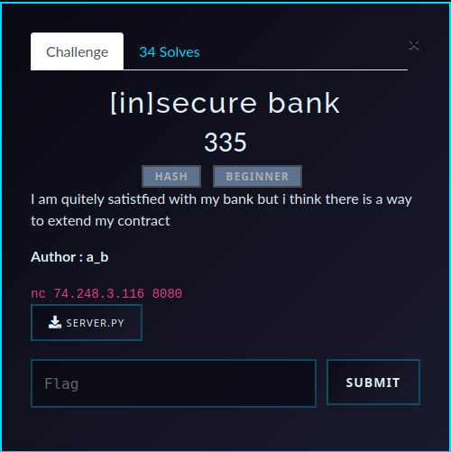

# [in]secure bank (Crypto) — Writeup

## Challenge Overview
A Python banking app starts us with a balance of `1000`, and the flag costs `1000000`.
<p align="center">
  
</p>

<details>
<summary>server.py</summary>

<!-- AUTO:SERVER:START -->
```python
#!/usr/bin/env python3
from os import urandom
from hashlib import  sha256, md5
from binascii import hexlify, unhexlify
banner = r'''
  ___ _      ___                                 _                 _     
 |  _(_)    |_  |                               | |               | |    
 | |  _ _ __  | |___  ___  ___ _   _ _ __ ___   | |__   __ _ _ __ | | __ 
 | | | | '_ \ | / __|/ _ \/ __| | | | '__/ _ \  | '_ \ / _` | '_ \| |// / 
 | | | | | | || \__ \  __/ (__| |_| | | |  __/  | |_) | (_| | | | |   <  
 | |_|_|_| |_|| |___/\___|\___|\__,_|_|  \___|  |_.__/ \__,_|_| |_|_|\_\ 
 |___|      |___|                                                        
'''

menu = r'''================================================================
    1-view balances
    2-generate token
    3-make transaction
    4-buy flag
    5-exit
================================================================
'''

class client:
    def __init__(self, name, balance):
        self.name = name
        self.balance = balance


GLOBAL_SECRET=urandom(16)

class Transaction:
    def __init__(self, sender, receiver, amount):
        self.sender = sender
        self.receiver = receiver
        self.amount = amount
        self.secret = GLOBAL_SECRET

    def __str__(self) -> str:
        return f"{self.sender}->{self.receiver}:{self.amount}"

    def gen_inner(self,d) -> bytes:
        return sha256(self.secret + d).hexdigest().encode()

    def gen_outer(self, inner: bytes) -> str:
        return md5(inner).hexdigest()

    def gen_token_double(self) -> bytes:
        data = str(self).encode()
        inner = self.gen_inner(data)
        outer = self.gen_outer(inner).encode()
        payload = data + b"|" + inner + b"|" + outer
        return hexlify(payload)

    def verify_token_double(self, token_hex) :

        raw = unhexlify(token_hex)
        data = b"|".join(parts[:-2])
        inner,outer = parts[-2],parts[-1]
        if b'|' not in raw:
            return False, None

        expected_outer = self.gen_outer(self.gen_inner(data)).encode()
        expected_inner = self.gen_inner(data)

        if outer != expected_outer or inner != expected_inner:
            return False, None
        return True, data

if __name__ == "__main__":
    print(banner)
    name = input("Enter your name: ").strip()
    print(f"Welcome, {name}!")
    user = client(name, 1000)
    bank = client("bank", 99999999)
    clients = {user.name: user, bank.name: bank}
    FLAG = "Pioneers25{REDACTED}"
    print(menu)
    while True:
        try:
            
            choice_s = input("Enter your choice: ").strip()
            if not choice_s.isdigit():
                print("Please enter a number.")
                continue
            choice = int(choice_s)
            if choice == 1:
                print("Balances:")
                for c in clients.values():
                    print(f"{c.name}: {c.balance}")

            elif choice == 2:
                s = user.name
                r = input("Enter receiver: ").strip()
                a = input("Enter amount: ").strip()
                if not a.isdigit() or int(a) <= 0 or int(a) > user.balance:
                    print("Invalid amount!")
                    continue
                amount = int(a)
                tr = Transaction(user.name, r, amount)
                token = tr.gen_token_double()
                print("Here is your token:", token.decode())

            elif choice == 3:
                token_input = input("Enter your token (hex): ").strip()
                if not token_input:
                    print("No token provided.")
                    continue
                raw = unhexlify(token_input)
                parts = raw.split(b"|")
                data = parts[-3]
                if b"->" not in data or b":" not in data:
                    print("Malformed transaction data.")
                    continue
                if b'|' in data:
                    _,data = data.split(b"|", 1)
                sender, rest = data.split(b"->", 1)
                receiver, amount_str = rest.rsplit(b":", 1)
                if sender == b"bank":
                    print("Transactions from the bank are not allowed.")
                    print("Are you trying to cheat?")
                    continue
                try:
                    amount,sender,receiver = int(amount_str), sender.decode(), receiver.decode()
                except Exception:
                    print("Invalid data in token.")
                    continue

                tr = Transaction(sender, receiver, amount)
                ok, got = tr.verify_token_double(token_input)
                if not ok:
                    print("Token verification failed.")
                    continue
                sender_client = clients.get(sender)
                if sender_client is None:
                    print("Unknown sender account.")
                    continue
                if sender_client.balance < amount:
                    print("Insufficient balance to perform this transaction.")
                    continue
                
                sender_client.balance -= amount
                recv_client = clients.get(receiver)
                if recv_client is None:
                    recv_client = client(receiver, 0)
                    clients[receiver] = recv_client
                recv_client.balance += amount
                print(f"Transaction applied: {sender} -> {receiver} : {amount}")
                print(f"New balance for {sender}: {sender_client.balance}")

            elif choice == 4:
                print('buying the bank for 1000000')
                if user.balance >= 1000000:
                    print('you are the new owner of the bank')
                    print("Here is your flag:", FLAG)
                    
                else:
                    print("Insufficient balance!")

            elif choice == 5:
                print("Exiting...")
                break

            else:
                print("Invalid choice!")
            print()
        except KeyboardInterrupt:
            print("\nForcing exit :(")
            break
        except Exception as e:
            print("Error:", e)
            print("Please try again.")
            print()
```
<!-- AUTO:SERVER:END -->


</details>


Transactions are authenticated with this token format:

- `inner = sha256(GLOBAL_SECRET + data).hexdigest()`
- `outer = md5(inner).hexdigest()`
- token = hex of `data|inner|outer`

where `GLOBAL_SECRET` is 16 random bytes and `data` is `sender->receiver:amount`.

## Vulnerability
The app uses `sha256(secret || message)` as a MAC (prefix-MAC), which is vulnerable to **SHA-256 length extension**.


So if we know:
- `H = sha256(secret || data)`
- `len(secret) = 16`

we can compute a valid hash for `data || pad || suffix` without knowing `secret`.

## Exploit Logic
We append this suffix during length extension:

`|<user>->bank:-10000000`

During transaction parsing, the server ends up using:
- `sender = <user>`
- `receiver = bank`
- `amount = -10000000`

Checks still pass because:
- sender is not `bank`
- `sender.balance < amount` is false for negative amounts

Then this line executes:

`sender.balance -= amount`

Subtracting a negative value increases our balance by 10,000,000.

## Steps to Solve
1. Start server and enter username (example: `a`).
2. Use option `2` to generate a normal token.
3. Run:

`python3 solver.py`

4. Paste original token into solver.
5. Copy forged token output by solver.
6. Use option `3` and submit forged token.
7. Check balance with option `1` (it should be above 1,000,000).
8. Use option `4` to buy the bank and get the flag.

## Solver Notes
`solver.py` performs pure-Python SHA-256 length extension:
- reconstructs internal SHA-256 state from known digest,
- builds correct padding for `secret || original_data`,
- continues hashing with attacker-controlled suffix,
- recomputes `outer = md5(new_inner)`.

<details>
<summary>solver.py</summary>

<!-- AUTO:SOLVER:START -->
```python
"""Forge a valid transaction token without hashpumpy.

This implements SHA-256 length extension in pure Python to avoid the
PY_SSIZE_T_CLEAN runtime error that the C-extension build of hashpumpy hits
on newer Python versions.
"""

from binascii import hexlify, unhexlify
from hashlib import md5
import struct


# SHA-256 constants
K = [
	0x428A2F98, 0x71374491, 0xB5C0FBCF, 0xE9B5DBA5, 0x3956C25B, 0x59F111F1, 0x923F82A4, 0xAB1C5ED5,
	0xD807AA98, 0x12835B01, 0x243185BE, 0x550C7DC3, 0x72BE5D74, 0x80DEB1FE, 0x9BDC06A7, 0xC19BF174,
	0xE49B69C1, 0xEFBE4786, 0x0FC19DC6, 0x240CA1CC, 0x2DE92C6F, 0x4A7484AA, 0x5CB0A9DC, 0x76F988DA,
	0x983E5152, 0xA831C66D, 0xB00327C8, 0xBF597FC7, 0xC6E00BF3, 0xD5A79147, 0x06CA6351, 0x14292967,
	0x27B70A85, 0x2E1B2138, 0x4D2C6DFC, 0x53380D13, 0x650A7354, 0x766A0ABB, 0x81C2C92E, 0x92722C85,
	0xA2BFE8A1, 0xA81A664B, 0xC24B8B70, 0xC76C51A3, 0xD192E819, 0xD6990624, 0xF40E3585, 0x106AA070,
	0x19A4C116, 0x1E376C08, 0x2748774C, 0x34B0BCB5, 0x391C0CB3, 0x4ED8AA4A, 0x5B9CCA4F, 0x682E6FF3,
	0x748F82EE, 0x78A5636F, 0x84C87814, 0x8CC70208, 0x90BEFFFA, 0xA4506CEB, 0xBEF9A3F7, 0xC67178F2,
]


def _rotr(x: int, n: int) -> int:
	return ((x >> n) | (x << (32 - n))) & 0xFFFFFFFF


def _pad(msg_len_bytes: int) -> bytes:
	pad_len = (64 - ((msg_len_bytes + 1 + 8) % 64)) % 64
	return b"\x80" + b"\x00" * pad_len + struct.pack(">Q", msg_len_bytes * 8)


def _compress(state, chunk: bytes):
	assert len(chunk) == 64
	w = list(struct.unpack(">16I", chunk)) + [0] * 48
	for i in range(16, 64):
		s0 = _rotr(w[i - 15], 7) ^ _rotr(w[i - 15], 18) ^ (w[i - 15] >> 3)
		s1 = _rotr(w[i - 2], 17) ^ _rotr(w[i - 2], 19) ^ (w[i - 2] >> 10)
		w[i] = (w[i - 16] + s0 + w[i - 7] + s1) & 0xFFFFFFFF

	a, b, c, d, e, f, g, h = state
	for i in range(64):
		S1 = _rotr(e, 6) ^ _rotr(e, 11) ^ _rotr(e, 25)
		ch = (e & f) ^ (~e & g)
		temp1 = (h + S1 + ch + K[i] + w[i]) & 0xFFFFFFFF
		S0 = _rotr(a, 2) ^ _rotr(a, 13) ^ _rotr(a, 22)
		maj = (a & b) ^ (a & c) ^ (b & c)
		temp2 = (S0 + maj) & 0xFFFFFFFF
		h, g, f, e, d, c, b, a = (
			g,
			f,
			e,
			(d + temp1) & 0xFFFFFFFF,
			c,
			b,
			a,
			(temp1 + temp2) & 0xFFFFFFFF,
		)

	return [
		(a + state[0]) & 0xFFFFFFFF,
		(b + state[1]) & 0xFFFFFFFF,
		(c + state[2]) & 0xFFFFFFFF,
		(d + state[3]) & 0xFFFFFFFF,
		(e + state[4]) & 0xFFFFFFFF,
		(f + state[5]) & 0xFFFFFFFF,
		(g + state[6]) & 0xFFFFFFFF,
		(h + state[7]) & 0xFFFFFFFF,
	]


def _process(state, data: bytes):
	assert len(data) % 64 == 0
	for i in range(0, len(data), 64):
		chunk = data[i : i + 64]
		state = _compress(state, chunk)
	return state


def sha256_lenext(orig_digest_hex: str, append: bytes, key_len: int, orig_data: bytes):
	state = [int(orig_digest_hex[i : i + 8], 16) for i in range(0, 64, 8)]

	ml = key_len + len(orig_data)  # bytes already hashed (secret + orig_data)
	pad1 = _pad(ml)

	total_len = ml + len(pad1) + len(append)
	pad2 = _pad(total_len)

	continuation = append + pad2
	state2 = _process(state, continuation)

	new_digest_hex = "".join(f"{x:08x}" for x in state2)
	forged_data = orig_data + pad1 + append
	return new_digest_hex, forged_data


user = "a"  # the name you entered at start
orig_token = input("Paste token from option 2: ").strip()

raw = unhexlify(orig_token)
parts = raw.split(b"|")
data, inner_hex, outer_hex = parts[-3], parts[-2], parts[-1]
orig_data = data
known_digest = inner_hex.decode()

suffix = b"|" + user.encode() + b"->bank:-10000000"
new_inner_hex, new_data = sha256_lenext(known_digest, suffix, 16, orig_data)
new_outer_hex = md5(new_inner_hex.encode()).hexdigest()
forged = hexlify(new_data + b"|" + new_inner_hex.encode() + b"|" + new_outer_hex.encode())
print(f"Forged token:\n{forged.decode()}")
```
<!-- AUTO:SOLVER:END -->

</details>

## Root Causes
- Insecure MAC construction (`sha256(secret || message)` instead of HMAC).
- Missing validation for non-positive amounts in transaction execution.
- `md5(inner)` does not add meaningful security.

## Fixes
- Replace custom MAC with `HMAC-SHA256`.
- Reject `amount <= 0` when applying transactions.
- Use strict, unambiguous token parsing/serialization.
